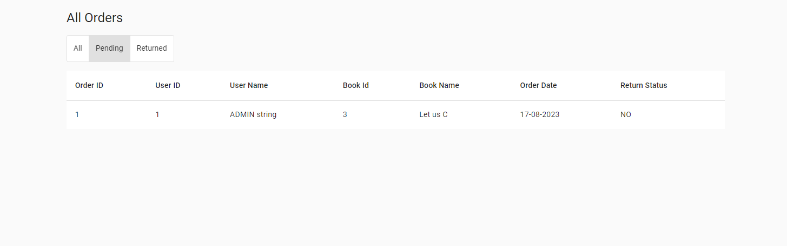
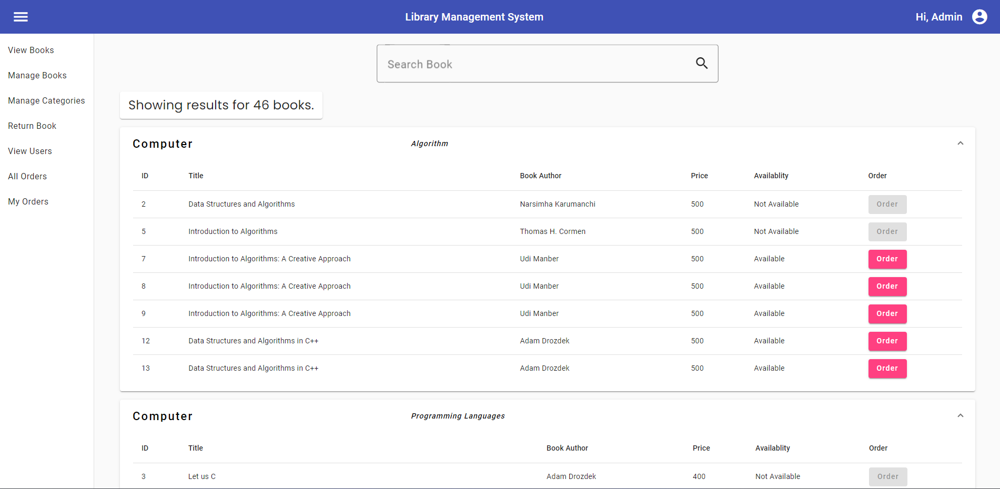
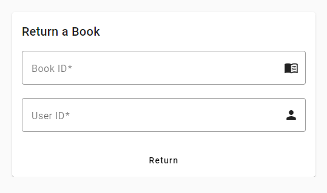

# LibraryManagementSystem
The Library Management System developed using Angular 16 and .NET Core 6 Web API is a comprehensive platform designed to streamline the process of managing books and user interactions within a library environment. 

